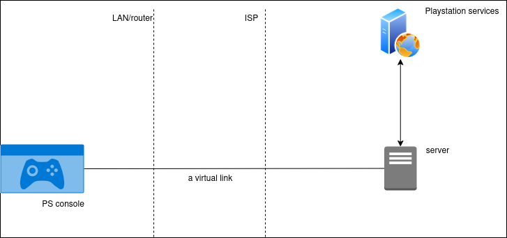

# PS NAT 3 Resolver

Playstation console classifies how open it is for network connections and presents it as a NAT type in network settings. Possible types are from 1 to 3 while type 3 is the most strict and can prevent multiplayer to work in some games, like Gran Turismo 7.

PS NAT 3 Resolver is a script that setups network in the way that you get NAT type 2 on a console. It takes efforts for initial setup but easy in use later providing only 2 commands - setup and cleanup network configuration.

Note that there are other solutions I encourage to check first because they are easier to follow and may help depending on your current network conditions:

- if you have a public IP address, setup Port Forwarding
- if you have a private IP address, ask your ISP for a public address. Once done, go back to a previous option - setup Port Forwarding

In the end if you still have a private IP address and no way to get a public one, give this solution a try.

## Solution overview

The key is to have a public IP address to open a console for incoming connections multiplayer requires. But what if you have a private address and no way of taking a public one? My solution is to take a server with a public address and make it act as a router for a console. With this the only thing remains is to configure traffic flow to/from a console. This is what PS NAT 3 Resolver does!

In result network setup looks like this



It includes the next components:
- a console
- Playstation services

It is external services the console needs to communicate with to enable multiplayer features 

- a server

Server is a machine with an important characteristic for our case - public address. After network setup this server will act as a router for a console.

The diagram contains one more thing that remains uncovered - a virtual link.
We cannot connect both a console and a server physically via a cable since a server does not reside in front of us. Still some sort of link is needed to enable traffic flow between both and that is where a virtual link comes into play.

The virtual link connects a console to the server is if they were connected directly via a cable. You see how the link crosses LAN (home network) and ISP boundaries, meaning that from perspective of a console it looks like it is connected to the server directly. The consequence of this is that the console is connected to a router with a public address.

Now 2 questions are still open:

- where to take a server

For a server in fact any Linux machine with a public address will work, but for this solution I take a server on Digital Ocean. Significant benefit of it is that one can take and release a server any time and use it exactly so long as needed

- how to setup traffic flow according to the diagram

Network setup consists of establishing a virtual link and configuring traffic flow to/from a console. This is mostly in software and you will not need any extra devices, except one.

## Prerequisites

- Linux-based machine

To make a virtual link one intermediate device is needed - Linux-based PC, like a laptop with Ubuntu OS. The reason for this is that a console does not allow non standart network configuration so it cannot create a virtual link but a Linux PC can. You can use your usual workstation laptop or Raspberry Pi if you have one

- shared network

Your console and a Linux PC should be connected to the same network like home router, wired or wireless. Wired is preferred for both to reach the best speed

- static IP addresses

Linux PC and a console are better to have static IP addresses. It can be set in router configuration page, DHCP section. Refer to your router manual on how to access router settings and assign static IPs

- Digital Ocean account

Digital Ocean account is required to let the script reserve/release a server on your behalf. The script uses the cheapest server Digital Ocean provides - 1vcpu-512mb-10gb, which currently costs 4$ per month and is powerful enough for the task. Note that usually it will cost you even less since you won't need to keep the server 24/7

Go to Digital Ocean, create an account and add billing info. Then go to API menu at the left, Tokens section, and generate a new token with params as below. The script requires this token to access Digital Ocean and reserve/release a server:
  - set any Token name, for instance "PS NAT 3 Resolver"
  - set Expiration to No expire
  - for scopes:
    - search droplet, select all 4 permissions (create/read/update/delete)
    - search ssh_key, select all 4 permissions (create/read/update/delete)

Make a note of the generated token for later.

## Installation

Download the latest version of the script as ZIP from [Releases](https://github.com/anton-ptashnik/ps-nat3-resolver/releases/latest) to your Linux PC and unpack to any location. Use install script for installation:

```
chmod +x ./install.sh
sudo ./install.sh
```

Once installed you need to fill params in a file `config/user.conf` before the first usage. The file looks as below:

```
# Digital Ocean API token used to let the script reserve/release a server
# Put your value in between quotes
DO_TOKEN=''

# IP address of your console. Find it in console Settings->Network->View connection info
# Put your value in between quotes
PS_IP=''
```

Once parameters are filled the script is ready for work. Now all commands can be run as provided in `Usage`, without a preceding `cd` command and `./` before the script name.

Note that the script is a CLI application (non-GUI) so it should be run from a Terminal window. Find and open a Terminal app then run the script specifying a needed command, for instance `up`:

```
cd <path-to-script-folder>
sudo psnat3resolver up
```

To uninstall use the corresponding script:

```
chmod +x ./uninstall.sh
sudo ./uninstall.sh
```

## Usage

The script has only 2 commands, easy:

- sudo psnat3resolver up

Setups the network, which includes: reserving a server, establishing a virtual link and setting up traffic flow to/from a console. Note it is the moment when you start to pay for a server since the server is reserved for you now

- sudo psnat3resolver down

Cleanups the network, which includes the opposite: releasing a server and removing network config done by `up` command. Note it is the moment when you stop to pay for a server since the server is released now

- sudo psnat3resolver status

Shows network status and params to set on a console. Additionally performs network diagnostics and reports result

Use `up` command to make the script setup a network, then follow script output to complete the setup. You will be asked to update console network params to start passing console traffic via a network the script configured. One may modify existing connection params on a console but better to create a separate profile and switch between them when needed.

Go to `Settings->Network` on a console and then `Set up a new connection` to create a new network profile, select `Manual/Advanced mode` which allows to specify params like address, gateway and DNS. Enter the params provided in script output for `up` command. Once done, check Internet connection on a console - `Settings->Network->Test connection`, after a few sec it should show NAT type 2. Multiplayer should work now, enjoy playing!

## Recommendations

- execute `down` command when have no plans to play

You pay for a server the script reserves for you. Despite it is not expensive, 4$ per month, you can save by cleaning network setup when you are not going to play the next 5 days on instance. Just use `down` command and use `up` before playing the next time to setup network again

- use wired connection

For best network speed connect your console and a Linux machine to a router with cables. Wireless will also work but wired connection is usually faster

## Automatic mode

The script can be switched to automatic mode, allowing it to manage the network based on network activity from a PS console. Once the mode is enabled, the script starts monitoring network and responds as follows:

- When PS network activity is observed, the script brings the network up.
- If no activity is observed for a configurable idle timeout period, the script will automatically bring the network down.

This ensures that a server VM is used only when needed saving some bill and freeing from a need to remember to manually bring the network up or down each time before/after the play. Network idle timeout can be adjusted by setting `NETWORK_IDLE_TIMEOUT_HOURS` in `config/user.conf`, thus controling how long it takes for the script to consider the network idle and shut it down.

To enable automatic mode, first switch CLI to this mode:
```
sudo psnat3resolver auto
```

Now script commands have new meaning:
```
sudo psnat3resolver

PS NAT3 Resolver, mode: auto
Usage: sudo psnat3resolver up|down

Commands:
  sudo psnat3resolver up - start monitoring, up/down network automatically based on PS network activity
  sudo psnat3resolver down - stop monitoring
  sudo psnat3resolver status - show network status
  sudo psnat3resolver manual - switch to manual mode
```

When the script is in auto mode, `up/down` commands enable/disable automatic network management, when in manual mode - `up/down` commands manage the network directly, ie the network gets setup/cleaned up immediately when commands are entered.

To switch back to manual mode use:

```
sudo psnat3resolver manual
```